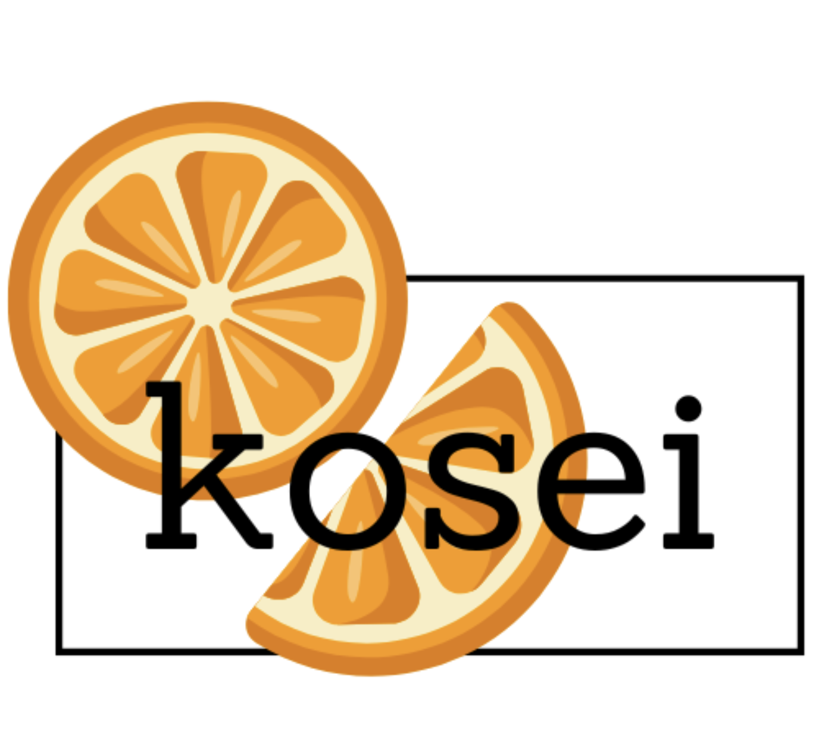

**Curated Health at Your Fingertips**

Kosei is a mobile application designed to revolutionize the way people interact with food by combining nutrition, pantry management, and sustainability. Our mission is to empower consumers to make healthier choices, reduce food waste, and simplify grocery shopping through data-driven tools and user-centric design.

---

## Problem

- Nearly **40% of the U.S. food supply** ends up in landfills.
- Over **70% of our food supply** is considered "ultra-processed."

Consumers face a lack of actionable insight at the point of purchase and in their kitchens.

---

## Solution

Kosei connects grocery products to nutritional categories using a powerful backend database. Users can:

- Scan grocery items for instant nutritional analysis
- Track pantry items and expiration dates
- Discover recipes using what they already own
- Receive personalized product recommendations
- Monitor dietary goals and progress
- Reduce food waste through smart kitchen insights

---

## Target Audience

Our app is tailored for:

- Health-conscious individuals
- Environmentally-aware families
- Grocery partners and brands looking for advertising opportunities

---

## Competitive Advantage

- Secret proprietary algorithm for personalized nutrition analysis
- Efficient database navigation and virtual kitchen tracking
- Scientifically-grounded recommendations

---

## Business Model

Revenue streams include:

- **Premium app subscriptions**: $4.99/month
- **Brand advertising partnerships**
- **Grocery store partnerships and data licensing**

---

## Market Opportunity

- **Total Addressable Market (TAM)**: $816.3B (Global Nutrition Market)
- **Serviceable Obtainable Market (SOM)**: $149.7B (Digital Food App Market)

---

## Tech Stack (Planned)

- Frontend: React Native or Flutter
- Backend: Python / Node.js with REST API
- Database: PostgreSQL or MongoDB
- Hosting: AWS
- Mobile Platforms: iOS & Android

---

## Timeline

| Quarter | Milestone |
|---------|-----------|
| Q1      | Finalize business model & brand development |
| Q2      | Develop core app features and database integration |
| Q3      | Launch marketing campaigns and build partnerships |

---

## Intellectual Property

Kosei uses proprietary algorithms and secret database profiling methods to deliver high-quality, personalized recommendations. The company is structured as a **C Corporation** and maintains all core technology as trade secrets.

---

## 🤝 Investment Opportunity

We are seeking an investment of **$1.3 million** in exchange for **15% equity** and a board seat to help accelerate development, partnerships, and marketing.

---
